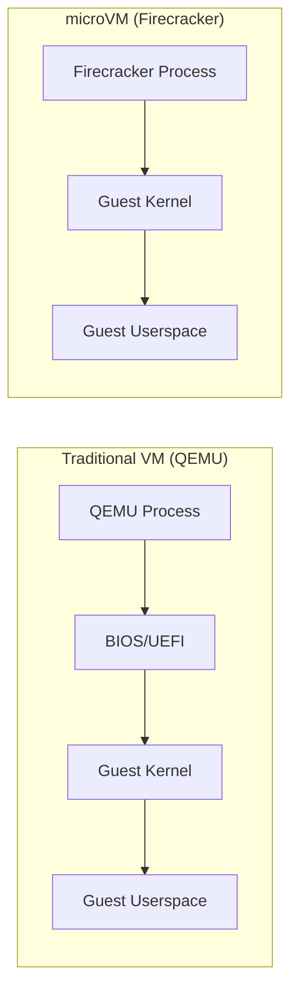
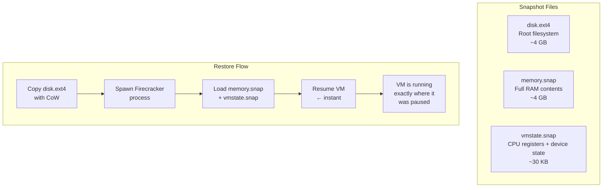
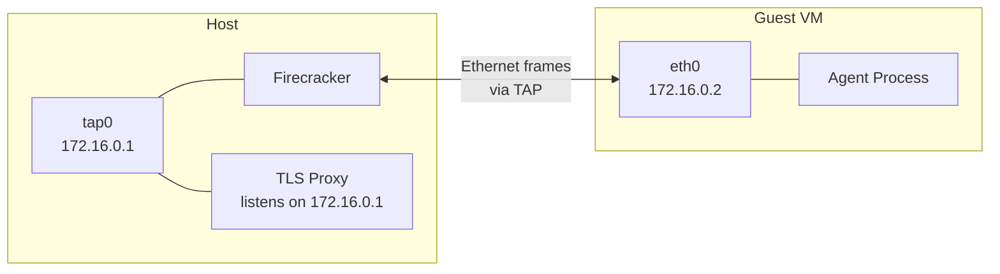
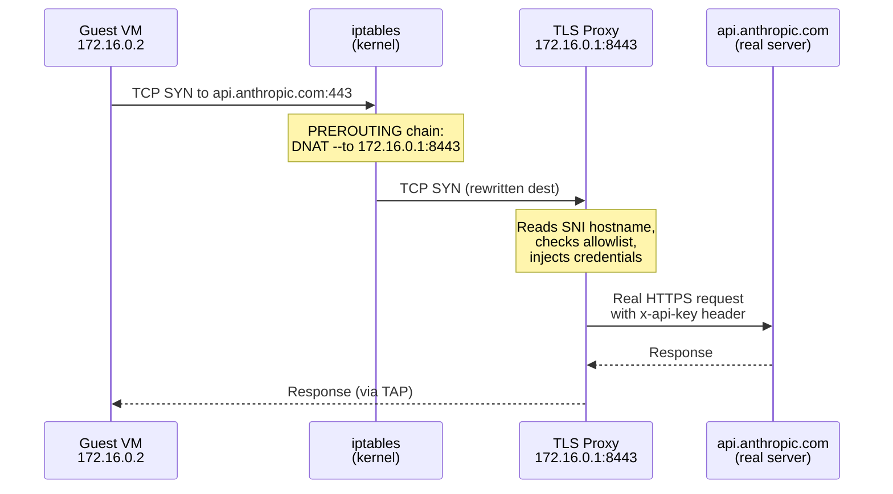
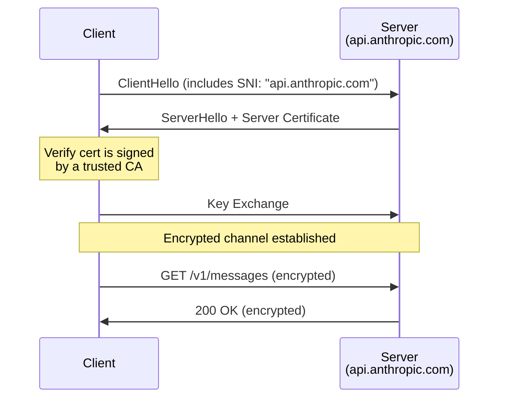
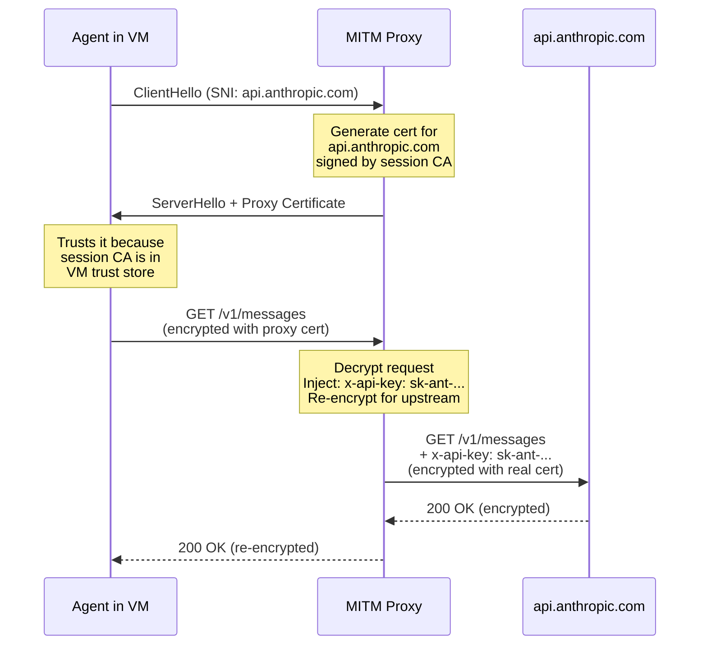
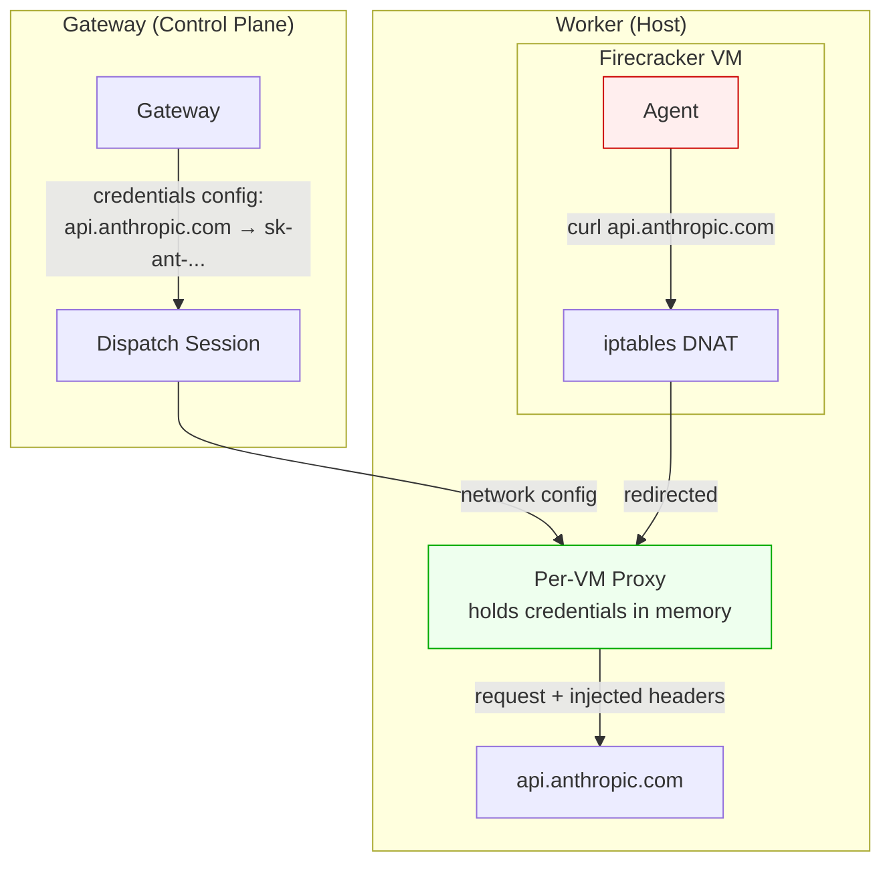
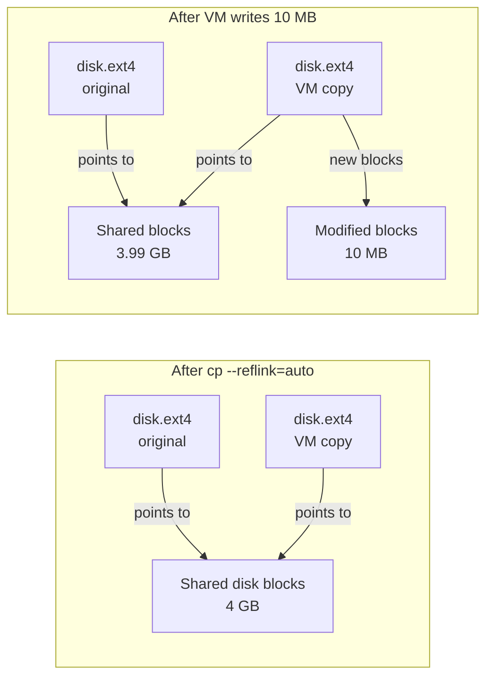

# Concepts

```
 /\_/\
( o.o )  the domain glossary
 > ^ <
```

A reference for the technologies and patterns that paws builds on. Read this before diving into the
architecture or security docs.

---

## Table of Contents

- [Virtualization](#virtualization) — KVM, Firecracker, snapshots
- [Networking](#networking) — TAP devices, iptables, DNAT, subnets
- [TLS & The MITM Proxy](#tls--the-mitm-proxy) — TLS handshakes, SNI, credential injection
- [Copy-on-Write (CoW)](#copy-on-write-cow) — instant disk cloning
- [Domain Glossary](#domain-glossary) — quick-reference table of every term

---

## Virtualization

### KVM (Kernel-based Virtual Machine)

KVM is a Linux kernel module that turns the host kernel into a hypervisor. It exposes
`/dev/kvm` — a device that lets userspace programs create and run virtual machines with
hardware-accelerated isolation.

```mermaid
graph TD
    A[Host Linux Kernel] -->|exposes| B[/dev/kvm]
    B -->|used by| C[Firecracker]
    B -->|used by| D[QEMU]
    B -->|used by| E[Cloud Hypervisor]
    C -->|creates| F[Lightweight microVM]
    D -->|creates| G[Full VM]
```

**Why it matters for paws:** KVM provides the same hardware-enforced isolation that AWS Lambda
uses. A compromised VM cannot escape to the host — the CPU itself enforces the boundary.

### Firecracker

Firecracker is Amazon's open-source microVM monitor (VMM). Think of it as a stripped-down
alternative to QEMU that boots VMs in ~125ms with minimal overhead.



| Feature         | QEMU                   | Firecracker                         |
| --------------- | ---------------------- | ----------------------------------- |
| Boot time       | ~2-5 seconds           | ~125ms (cold), <50ms (snapshot)     |
| Device model    | Full (USB, GPU, sound) | Minimal (virtio-net, virtio-block)  |
| Memory overhead | ~50-100 MB             | ~5 MB                               |
| Attack surface  | Large                  | Tiny (reduced device model)         |
| Use case        | General VMs            | Ephemeral, single-purpose workloads |

**Why paws uses Firecracker:** We need sub-second boot for on-demand agent sessions. Each session
spins up a fresh VM, runs a workload, and destroys it. Firecracker's snapshot restore gets us
there.

### Firecracker Snapshots

A snapshot captures a running VM's entire state so it can be restored instantly — no boot
sequence, no kernel init, no service startup.



The VM doesn't "boot" — it resumes execution from the exact instruction where it was paused.
SSH is already running, the network is already configured, packages are already installed.

---

## Networking

### TAP Devices

A TAP (network **T**un/**A**dapt**P**) device is a virtual network interface that lets a
userspace program (like Firecracker) send and receive Ethernet frames as if it were a physical
NIC.



Each VM gets its own TAP device (`tap0`, `tap1`, ...) connected to a `/30` subnet. This means
each VM is on its own isolated network — VMs cannot see each other's traffic.

### /30 Subnets

A `/30` subnet has 4 IP addresses — just enough for a point-to-point link:

| Address | Role              | Example (VM 0) |
| ------- | ----------------- | -------------- |
| `.0`    | Network address   | `172.16.0.0`   |
| `.1`    | Host side (proxy) | `172.16.0.1`   |
| `.2`    | Guest side (VM)   | `172.16.0.2`   |
| `.3`    | Broadcast         | `172.16.0.3`   |

paws packs these sequentially in `172.16.0.0/16`, supporting up to 16,384 concurrent VMs.

### iptables & DNAT

**iptables** is the Linux kernel's packet filtering and NAT framework. It processes network
packets through chains of rules organized in tables.

**DNAT (Destination NAT)** rewrites a packet's destination address before routing. paws uses
this to transparently redirect VM traffic to the per-VM proxy:



The VM never knows its traffic is being intercepted — it resolves DNS normally and connects to
the real IP. The kernel rewrites the destination before the packet leaves the TAP device.

**iptables rules per VM:**

```
# Table: nat, Chain: PREROUTING — redirect before routing decision
DNAT  tcp  tap0  --dport 80   → 172.16.0.1:8080   (HTTP)
DNAT  tcp  tap0  --dport 443  → 172.16.0.1:8443   (HTTPS)

# Table: filter, Chain: FORWARD — what's allowed to pass through
ACCEPT  tap0 → 172.16.0.1     (allow traffic to proxy)
ACCEPT  → tap0  RELATED,ESTABLISHED  (allow responses back)
DROP    tap0 → anywhere        (block everything else)
```

The result: the VM can only talk to its own proxy. No internet, no other VMs, no host services.

---

## TLS & The MITM Proxy

### TLS Handshake (Simplified)

TLS (Transport Layer Security) encrypts HTTP traffic. Here's the normal flow:



**SNI (Server Name Indication)** is a TLS extension where the client sends the target hostname
in plaintext during the handshake. This is how the proxy knows which domain the VM is trying to
reach — before any encrypted data is exchanged.

### MITM (Man-in-the-Middle) Proxy

The paws proxy intercepts TLS by presenting its own certificate to the VM, then opening a
separate TLS connection to the real server:



**Why this works:** Before the VM starts, paws injects a per-session CA certificate into the
VM's trust store. The proxy uses this CA to sign certificates on-the-fly for each domain.
The VM trusts these because it trusts the CA.

**Why this is safe:**

- The CA is ephemeral — generated per session, destroyed when the session ends
- The CA is unique — each VM gets its own, so compromising one doesn't affect others
- The CA never leaves the host — only the public cert is injected into the VM

### Credential Injection Flow

This is the key security feature: API keys never enter the VM.



The agent in the VM makes a normal HTTPS request. It has no idea that:

1. Its traffic is being redirected to a local proxy
2. The proxy is terminating and re-establishing TLS
3. Credential headers are being injected into its requests

If the agent is compromised by prompt injection, there are no secrets to steal.

---

## Copy-on-Write (CoW)

### What It Is

Copy-on-Write is a filesystem optimization where copying a file doesn't actually duplicate the
data on disk. Instead, both the original and copy point to the same blocks. Data is only
duplicated when one of them is **modified**.



### Why It Matters for paws

Each VM session starts by "copying" a 4 GB disk image. Without CoW, this would take seconds
and waste disk space. With CoW on btrfs or XFS:

| Operation       | Without CoW  | With CoW              |
| --------------- | ------------ | --------------------- |
| Copy 4 GB disk  | ~2-4 seconds | ~instant (< 1ms)      |
| Disk space used | 4 GB per VM  | Only modified blocks  |
| 10 VMs running  | 40 GB used   | ~4 GB + modifications |

paws uses `cp --reflink=auto` which uses CoW when the filesystem supports it, and falls back
to a regular copy otherwise.

---

## Domain Glossary

Quick reference for every domain term used in paws documentation.

### Virtualization & Isolation

| Term            | What it is                                                                  |
| --------------- | --------------------------------------------------------------------------- |
| **KVM**         | Linux kernel module that enables hardware-accelerated VMs via `/dev/kvm`    |
| **Firecracker** | Amazon's lightweight VMM (Virtual Machine Monitor) for microVMs             |
| **microVM**     | A minimal VM with stripped-down device model — fast to boot, tiny footprint |
| **Snapshot**    | Captured VM state (memory + CPU + disk) that can be restored instantly      |
| **vmstate**     | CPU register state + virtual device state at the moment of snapshot         |
| **memory.snap** | Full contents of the VM's RAM at snapshot time                              |
| **Guest**       | The operating system and processes running inside the VM                    |
| **Host**        | The physical server running Firecracker and the proxy                       |

### Networking

| Term           | What it is                                                                       |
| -------------- | -------------------------------------------------------------------------------- |
| **TAP device** | Virtual network interface bridging host and guest Ethernet frames                |
| **iptables**   | Linux kernel packet filtering/NAT framework (rules → chains → tables)            |
| **DNAT**       | Destination NAT — rewrites a packet's destination IP/port before routing         |
| **PREROUTING** | iptables chain that processes packets before the routing decision                |
| **FORWARD**    | iptables chain for packets being routed through the host (not to/from host)      |
| **conntrack**  | Connection tracking — lets iptables allow "related/established" response packets |
| **/30 subnet** | A 4-address subnet (network, host, guest, broadcast) for point-to-point links    |
| **CIDR**       | Notation like `172.16.0.0/30` — the `/30` means 30 bits for network, 2 for hosts |

### TLS & Proxy

| Term                           | What it is                                                                        |
| ------------------------------ | --------------------------------------------------------------------------------- |
| **TLS**                        | Transport Layer Security — encrypts HTTP traffic (HTTPS = HTTP over TLS)          |
| **SNI**                        | Server Name Indication — hostname sent in plaintext during TLS handshake          |
| **MITM proxy**                 | Man-in-the-Middle proxy — terminates TLS, inspects/modifies traffic, re-encrypts  |
| **CA (Certificate Authority)** | Entity that signs TLS certificates; browsers/VMs trust CAs in their trust store   |
| **Session CA**                 | Per-session ephemeral CA generated by paws — signs on-the-fly certs for the proxy |
| **ECDSA P-256**                | Elliptic curve algorithm used for session CA keys (fast, small, secure)           |
| **Trust store**                | OS-level list of trusted CA certificates (`/usr/local/share/ca-certificates/`)    |
| **Credential injection**       | Proxy adds secret headers (API keys) to requests before forwarding upstream       |
| **Allowlist**                  | List of domains the VM is permitted to reach; everything else is dropped          |

### Filesystem

| Term                    | What it is                                                          |
| ----------------------- | ------------------------------------------------------------------- |
| **CoW (Copy-on-Write)** | Filesystem optimization — copies share blocks until one is modified |
| **reflink**             | The CoW copy mechanism on btrfs/XFS (`cp --reflink=auto`)           |
| **ext4**                | Standard Linux filesystem used for VM root disk images              |
| **btrfs / XFS**         | Filesystems that support reflink/CoW for instant file copies        |
| **rootfs**              | Root filesystem image (`disk.ext4`) — the VM's entire disk          |

### paws Domain

> **Naming convention:** paws uses cat-themed names for core concepts. A **tree** (worker node)
> manages **boxes** (VMs), and each box runs a **kitten** (agent). The control plane orchestrates
> it all. "The control plane picks a tree, the tree builds a box, a kitten runs inside it."

| Term              | What it is                                                                        |
| ----------------- | --------------------------------------------------------------------------------- |
| **Tree**          | Worker node — the bare metal server that runs boxes (like a cat tree holds cats)  |
| **Box**           | Firecracker VM sandbox — the isolated environment a kitten runs in (cats + boxes) |
| **Kitten**        | AI agent running inside a box — born, does its thing, gone                        |
| **Session**       | One-shot workload execution: spin up box → run kitten → collect output → destroy  |
| **Daemon**        | Persistent role that spawns sessions on trigger events (webhook, cron, watch)     |
| **Control plane** | Central service — holds credentials, tracks sessions, serves the API              |
| **Trigger**       | Event that causes a daemon to spawn a session (webhook, cron schedule, or watch)  |
| **Governance**    | Per-daemon policy: rate limits, approval gates, audit logging                     |
| **Semaphore**     | Concurrency limiter with FIFO queue — controls how many boxes run in parallel     |
| **Workload**      | The script + env vars that run inside the box                                     |
| **State volume**  | Persistent storage at `/var/lib/paws/state/{role}/` — survives across sessions    |

### Infrastructure

| Term           | What it is                                                                              |
| -------------- | --------------------------------------------------------------------------------------- |
| **Hono**       | Lightweight TypeScript web framework used for gateway + worker HTTP APIs                |
| **Zod**        | TypeScript schema validation library — defines all API request/response shapes          |
| **neverthrow** | `Result`/`ResultAsync` types for explicit error handling (no thrown exceptions)         |
| **OpenAPI**    | API specification standard — paws generates it from Zod schemas via `@hono/zod-openapi` |
| **Turborepo**  | Monorepo build orchestrator — runs tasks in dependency order with caching               |

---

## Further Reading

- [Architecture](architecture.md) — system design, VM lifecycle, monorepo structure
- [Security](security.md) — threat model, zero-trust design, proxy details
- [Testing](testing.md) — test tiers, mocking strategy, VM test scaffold
- [API](api.md) — REST endpoint reference
- [Brand Language](brand.md) — voice, terminology, CLI personality, ASCII art rules
